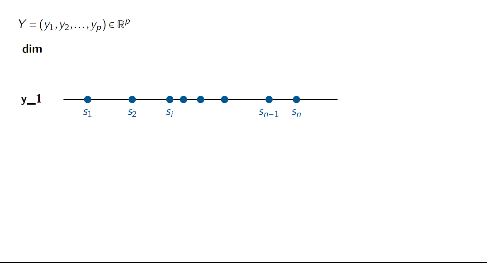

# Algorithmique: Uncertainty Quantification in Multi-Output Regression

This repository provides an R package implementing **conformal prediction techniques** to estimate **simultaneous prediction intervals** for multi-output regression tasks. The goal is to offer uncertainty-aware predictions with **provable guarantees**, even in high-dimensional settings.

## What's Included

- **Three uncertainty quantification methods**:

  - Beta-Optim: a calibration-based method
  - Fast Beta-Optim: a rank-based acceleration
  - Max Rank: a simple, extremely fast baseline

- **R + C++ implementations** for comparison

- **A tutorial** and benchmark results

---

## Problem & Motivation

In many fields such as **health monitoring**, **energy prediction**, or **financial forecasting**, we aim to predict not just a single value, but an entire curve (e.g., heart rate over 24 hours).

Yet, it's crucial to also answer:

> **"How confident am I in these predictions?"**

We want to provide prediction intervals that cover all dimensions of \$Y = (y\_1, y\_2, \dots, y\_p)\$ **simultaneously**, with a global probability \$1 - \alpha\$.

To solve this, we use **Conformal Prediction**, and in particular, we propose:

- **Beta-Optim**: a calibration-based method
- **Fast Beta-Optim**: a rank-based acceleration
- **Max Rank**: a simple, extremely fast baseline

---

## About Conformal Prediction

Conformal prediction is a statistical framework that allows us to construct prediction intervals that are valid **regardless of the underlying model**. It only requires that the data be **exchangeable**, which is a weaker condition than being i.i.d.

It provides the guarantee:

```text
P(Y_test ∈ C(X_test)) ≥ 1 − α
```

This means that the true target will lie inside the predicted interval at least \$(1 − \alpha)\$ of the time.

To better understand the conformal prediction procedure, here's the complete pipeline:

<p align="center">
  
</p>

### Coverage Guarantee

- **Exchangeability Assumption**: Assume that the calibration set \$(X\_i, Y\_i)\$ and the test point \$(X\_{\text{test}}, Y\_{\text{test}})\$ are exchangeable.

Then conformal prediction guarantees:
<p align="center">
  
</p>

This means we have a probabilistic bound on coverage even with finite calibration size.

---

## Features

- Generation of synthetic non-linear datasets with configurable output dimensions.
- Training of regression models using **polynomial regression** or **gradient boosting** (`xgboost`).
- Conformal prediction interval computation and coverage analysis.
- Tools for empirical evaluation and visualization.
- Fast C++ implementation for speed comparison with the R version.

---

## Installation

### R Package Dependencies

```r
install.packages(c("data.table", "xgboost", "caret", "R6", "Rcpp", "RcppArmadillo", "devtools", "roxygen2", "testthat"))
```

### Installing the Package from GitHub

```r
install.packages("devtools")
library(devtools)
devtools::install_github("fatima-zahra-hannou/Uncertainty_Quantification_in_MultiOutput_Regression")
```

### Setting Up a C++ Compiler (Windows Users)

Since Rcpp requires a C++ compiler, Windows users must install **Rtools**:

- Download from: [https://cran.r-project.org/bin/windows/Rtools/](https://cran.r-project.org/bin/windows/Rtools/)

---

## Tutorial

A step-by-step tutorial is provided in `Tutorial.pdf`, guiding you through:

1. Generating a synthetic dataset
2. Splitting data into training, calibration, and test sets
3. Training a model with `MLModel`
4. Applying uncertainty quantification using the `ModelUncertainties` class
5. Visualizing prediction intervals

### Example Workflow

```r
model <- MLModel$new(X_train, y_train, method = "gradient_boosting")
model$fit()

uncertainty_model <- ModelUncertainties$new(
  model = model,
  X_calibration = X_calib,
  Y_calibration = y_calib,
  uncertainty_method = "Beta_Optim",
  Global_alpha = 0.9
)

uncertainty_model$fit()
```

---

## Implemented Methods

### Beta-Optim
Binary search over $\beta$ to find the smallest value such that the simultaneous coverage is at least $1 - \alpha$.
  - This method searches for the smallest width of prediction intervals that ensures a target **simultaneous coverage**.
  - It uses **dichotomic optimization** on a parameter \( \beta \), which controls the tolerance of the intervals.
  - For each candidate \( \beta \), quantiles \( q_j(1-\beta) \) are computed per dimension, and coverage is evaluated.
    

$p$-dimensional quantiles for each $\beta$.
  - The optimal \( \beta^* \) minimizes the deviation from the desired coverage \( 1 - \alpha \).


### Max Rank

- Rank residuals column-wise
- For each row \$i\$, compute \$R\_{\max}^{(i)} = \max\_j \text{rank}\_{i,j}\$
- Construct intervals using a quantile of these max ranks

### Fast Beta-Optim
  - Combines the **rank-based speed** of Max Rank with the **coverage optimization** of Beta-Optim.
  - Instead of optimizing each dimension’s quantile separately, we optimize directly on the rank threshold.
  - This results in a much faster algorithm with similar coverage properties.
 Fast Beta-Optim

---

## Results

- The three methods were tested on simulated multivariate signals
- Max Rank Beta-Optim offers the best trade-off between **speed** and **coverage accuracy**

---

## Perspectives

- Extension to **dimension-wise beta optimization** (\$\beta\_j\$)
- Advantages:
  - Adjust the width of prediction intervals to the difficulty of each output
dimension.
  - Gain flexibility and potentially tighter intervals for easier-to-predict dimensions.
- Challenges:
  - How to ensure simultaneous coverage across all dimensions?
  - Requires new optimization strategies or regularization on β.
---

## Project Context

This work was developed as part of the **Algorithmique Project** at Université Paris-Saclay (M2 Data Science), under the supervision of Prof. Vincent Runge.

Refer to `Report_Project.pdf` for details.

---

## Authors

- Jaad Belhouari
- Fatima-Zahra Hannou
- Aymane Mimoun
